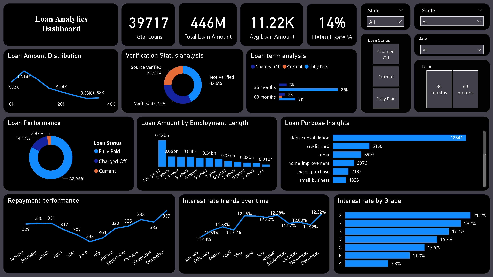

# 📊 Loan Analytics Dashboard

This project presents an interactive Power BI dashboard analyzing loan data to uncover insights into loan performance, customer behavior, and risk patterns.

---

## 🔹 Key Metrics
- Total Loans: 39,717  
- Total Loan Amount: 446M  
- Avg Loan Amount: 11.22K  
- Default Rate: 14%  

---

## 🔹 Key Insights
- Majority loans are fully paid (~83%)
- Debt consolidation is the most common loan purpose
- Higher risk grades have higher interest rates
- Loan distribution shows concentration in mid-range loan amounts

---

## 🔹 Features
- Interactive filters (State, Grade, Term)
- Loan performance analysis
- Interest rate trends over time
- Employment vs loan amount insights

---

## 📷 Dashboard Preview

---

## 🛠 Tools Used
- Power BI  
- DAX  
- Data Modeling  
- Data Visualization  
